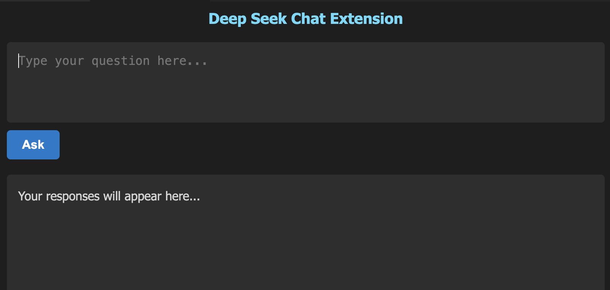

# Deep Seek Chat Extension

**Deep Seek Chat Extension** is a Visual Studio Code extension that integrates with Ollama's AI models to provide intelligent responses to user prompts. It features a responsive UI, real-time streaming updates, and Markdown rendering for better interaction and readability.

---

## ✨ Features

- **AI Chat Integration**: Send prompts and get AI-generated responses using Ollama's API.
- **Live Streaming of Responses**: See responses update incrementally as they are generated.
- **Markdown Support**: AI responses are rendered with proper Markdown formatting.
- **Responsive and Modern UI**: The extension adapts to different window sizes for better usability.
- **Simple Interaction**: Use an "Ask" button to send prompts and view responses easily.

---

## 🚀 Getting Started

### Prerequisites

Ensure you have the following installed on your machine:

- [Node.js](https://nodejs.org) (for building the extension)
- [Ollama](https://ollama.ai/) (for AI responses)
- [Visual Studio Code](https://code.visualstudio.com/) (to run the extension)

## 🖼 UI Preview

Here is a how it looks like!

  

## 🚧 Limitations and Future Work

While **Deep Seek Chat Extension** provides a seamless AI-assisted chat experience, there are areas where improvements can be made. Below are the **current limitations** and potential **enhancements** for future development.

### 🔴 **Current Limitations**

- **Limited AI Model Customization**  
  Currently, the extension only supports `"deepseek-r1:8b"`, and users cannot switch models dynamically.

- **No Chat History Persistence**  
  Responses are **not saved** when the webview is closed, and past conversations cannot be retrieved.

- **Math Formatting Issues in Edge Cases**  
  While KaTeX renders most math expressions correctly, complex formulas such as **nested fractions** or **matrix notations** may not display properly.

- **Lack of Multi-Turn Memory**  
  The extension **does not retain conversation history**, meaning each query is processed independently without considering previous context.

- **Limited UI Customization**  
  Users currently **cannot change fonts, themes, or adjust text size**.

---

### 🚀 **Future Enhancements**

- **🔄 Support for Custom AI Models**  
  - Implement a **settings panel** allowing users to select different AI models or enter API keys.
  - Expand support for additional models, including OpenAI, Claude, and custom fine-tuned versions.

- **💾 Chat History Persistence**  
  - Enable **local storage** or **cloud-based logging** to retain chat history.
  - Implement a **"Load Previous Chats"** feature for recalling past conversations.

- **🧠 Memory for Context-Aware Responses**  
  - Introduce a **session-based memory** feature, allowing the AI to reference past messages.
  - Add an **option to clear session memory** when needed.

- **🎨 Customizable UI & Themes**  
  - Allow users to **toggle light/dark mode**.
  - Provide options for **custom fonts and font sizes**.

- **📖 Enhanced Math & Code Rendering**  
  - Improve KaTeX preprocessing for better **nested expressions and complex formulas**.
  - Add **syntax highlighting** for code snippets.

---